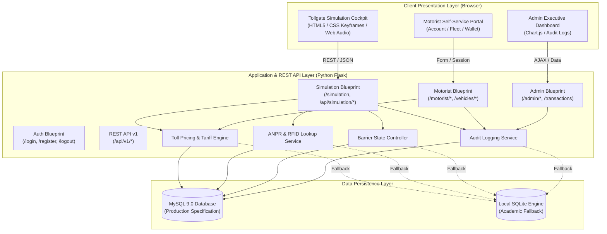
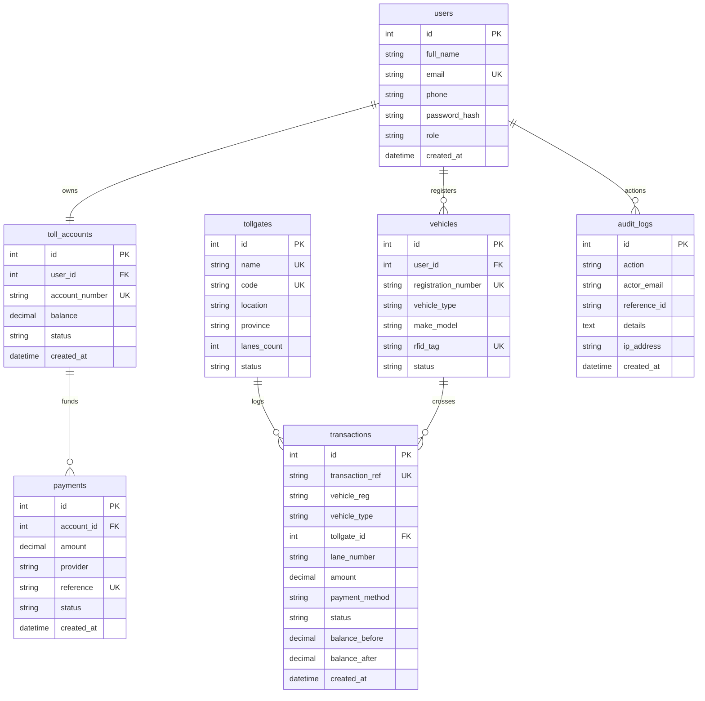

# System Architecture & Technical Specifications

> **Platform:** Integrated Automated Self-Service Tollgate & Management Platform for Zambia  
> **Academic Prototype:** 30% Functional Implementation &bull; 70% Architectural Roadmap

---

## 1. High-Level Architectural Model

The platform uses a layered, modular client-server architecture built on Python Flask and SQLAlchemy ORM, connecting to a relational database layer (MySQL with automatic fallback).



---

## 2. 30% Functional Implementation vs. 70% Future Scope

| Dimension | Implemented 30% Functional Core | 70% Planned Commercial Scope |
| :--- | :--- | :--- |
| **Vehicle Identification** | Interactive ANPR simulation with optical plate recognition & simulated RFID transponder lookup. | Physical Hikvision/Dahua 4K ANPR cameras, 5.8 GHz DSRC overhead gantry antennas. |
| **Fee Calculation** | Automatic Zambian statutory tariff (Light: K20, Med: K50, Hvy: K100, Abn: K250). | Multi-axle weigh-in-motion (WIM) sensor integration & dynamic toll discounts. |
| **Payment Verification** | Account balance deduction; instant simulated Mobile Money (Airtel, MTN, Zamtel). | Live telco aggregator B2B API contracts, USSD push prompts, and Zamlink interbank switches. |
| **Barrier Control** | Physical boom barrier animation (CSS keyframes), traffic light cycle, and audio chime. | Industrial PLC relay control (Siemens S7-1200) driving brushless DC servo motors. |
| **Motorist Accounts** | Web portal for registration, wallet balance tracking, and simulated top-ups. | Native cross-platform Flutter/React Native mobile app with biometric auth. |
| **Administration** | Centralized analytics, revenue charts, plaza volume, and transaction history. | National Operations Control Centre (NOCC) multi-screen video wall with CCTV feeds. |
| **Audit & Integrity** | Forensic logging of all logins, payments, deductions, and barrier events in MySQL. | Hardware Security Module (HSM) transaction signing with PKI infrastructure. |

---

## 3. Database Entity-Relationship Model



---

## 4. REST API Endpoint Documentation

### Public / Client Endpoints

#### 1. Retrieve Operational Toll Plazas
- **Endpoint:** `GET /api/v1/tollgates`
- **Response:**
  ```json
  [
    {
      "id": 1,
      "name": "Lusaka East Toll Plaza",
      "code": "TP-LUS-01",
      "location": "Great East Road, Chongwe District",
      "province": "Lusaka Province",
      "lanes_count": 6,
      "status": "OPERATIONAL"
    }
  ]
  ```

#### 2. Retrieve Statutory Toll Tariffs
- **Endpoint:** `GET /api/v1/rates`
- **Response:**
  ```json
  {
    "currency": "K",
    "currency_code": "ZMW",
    "tariffs": {
      "Light Vehicle": 20.00,
      "Medium Vehicle": 50.00,
      "Heavy Vehicle": 100.00,
      "Abnormal Load": 250.00
    }
  }
  ```

#### 3. Vehicle Lookup by Plate
- **Endpoint:** `GET /api/v1/vehicles/lookup/<plate>`
- **Response:**
  ```json
  {
    "found": true,
    "vehicle": {
      "registration_number": "ABC 1234",
      "vehicle_type": "Light Vehicle",
      "rfid_tag": "TAG-001"
    },
    "owner": "Chileshe Mwewa",
    "account_number": "NRFA-ACC-1001",
    "balance": 150.00
  }
  ```

### Simulation Endpoints

#### 4. Simulated Vehicle Arrival (ANPR)
- **Endpoint:** `POST /api/simulation/detect`
- **Payload:**
  ```json
  {
    "registration_number": "ABC 1234",
    "vehicle_type": "Light Vehicle",
    "tollgate_id": 1,
    "lane_number": "Lane 1"
  }
  ```
- **Response:**
  ```json
  {
    "detected": true,
    "registration_number": "ABC 1234",
    "vehicle_type": "Light Vehicle",
    "toll_fee": 20.00,
    "anpr_confidence": "98.4%",
    "is_registered": true,
    "balance": 150.00,
    "has_sufficient_balance": true
  }
  ```

#### 5. Simulated RFID / E-Tag Interrogation
- **Endpoint:** `POST /api/simulation/rfid-scan`
- **Payload:**
  ```json
  {
    "rfid_tag": "TAG-001",
    "registration_number": "ABC 1234",
    "vehicle_type": "Light Vehicle"
  }
  ```
- **Response:**
  ```json
  {
    "success": true,
    "rfid_tag": "TAG-001",
    "account_number": "NRFA-ACC-1001",
    "balance": 150.00,
    "toll_fee": 20.00,
    "has_sufficient_balance": true
  }
  ```

#### 6. Process Toll Payment (E-Tag or Mobile Money)
- **Endpoint:** `POST /api/simulation/process-payment`
- **Payload:**
  ```json
  {
    "registration_number": "ABC 1234",
    "vehicle_type": "Light Vehicle",
    "tollgate_id": 1,
    "lane_number": "Lane 1",
    "payment_method": "Toll Account / E-Tag"
  }
  ```
- **Response:**
  ```json
  {
    "success": true,
    "status": "SUCCESSFUL",
    "transaction_ref": "TXN-ZM-20260923120000-A1B2",
    "fee": 20.00,
    "balance_before": 150.00,
    "balance_after": 130.00,
    "barrier_action": "OPEN",
    "message": "Payment Successful! Barrier opening..."
  }
  ```

#### 7. Barrier State Machine Control
- **Endpoint:** `POST /api/simulation/barrier-trigger`
- **Payload:**
  ```json
  {
    "state": "OPEN",
    "lane_number": "Lane 1"
  }
  ```
- **Response:**
  ```json
  {
    "barrier_state": "OPEN",
    "timestamp": "2026-09-23 12:00:00",
    "message": "Barrier status: OPEN"
  }
  ```

---

## 5. Security & Audit Architecture

1. **Password Security:** Password hashes are generated using the `scrypt` key derivation function via `werkzeug.security.generate_password_hash`, defending against dictionary and rainbow-table attacks.
2. **Session Integrity:** HTTP session cookies are encrypted with Flask's cryptographic secret key, with role verification (`admin`, `motorist`) on sensitive endpoints.
3. **Forensic Audit Trail:** All critical operations trigger an immutable record in `audit_logs`:
   - `USER_REGISTERED`
   - `VEHICLE_REGISTERED`
   - `ACCOUNT_FUNDED`
   - `TOLL_PAYMENT_SUCCESS`
   - `TOLL_PAYMENT_FAILED_BALANCE`
   - `TOLL_PAYMENT_MOBILE_MONEY`
   - `BARRIER_OPENED` / `BARRIER_CLOSED`
   - `USER_LOGIN` / `USER_LOGOUT`
